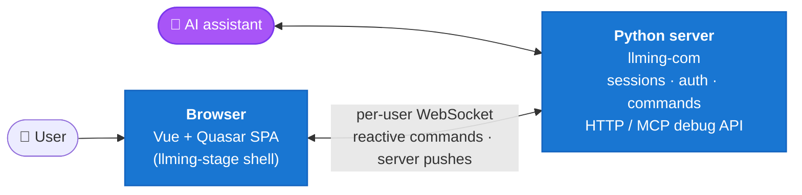

<p align="center"></p>

# llming-stage

[](https://www.python.org/downloads/)
[](https://github.com/Alyxion/llming-stage/blob/main/LICENSE)
[](https://pypi.org/project/llming-stage/)
[](https://github.com/astral-sh/ruff)

### Build Vue + Quasar UIs that AI can build, drive, and debug.

`llming-stage` is the SPA foundation for AI-assisted frontend work. You write a real Vue + Quasar app, not a Python shim. Reactive traffic and sessions flow through [`llming-com`](https://github.com/Alyxion/llming-com), and that's the same channel an AI assistant uses to inspect state, invoke commands, and push events into the running page.



`llming-com` ships the sessions, auth, command dispatcher, and the debug surface — without it, the AI side of the picture goes away. When you eventually deploy and the app no longer needs server reactivity, the same shell + view modules can ship as a static bundle to any CDN.

---

### What you get

- **An AI-debuggable runtime** — every reactive command, session, and event is browseable, invokable, and observable through one HTTP / MCP surface.
- **FastAPI-native app mounting** — create your own `FastAPI()` app and attach `Stage(app)`. The internal `/_stage` routes and development reload are ensured once.
- **Modern frontend, zero boilerplate** — Vue 3 + Quasar 2 + bundled Tailwind utilities with a lazy-load orchestrator and an SPA router that keeps the WebSocket and view state alive across navigations.
- **Per-user sessions out of the box** — `llming-com` runs the wire and the auth; you write JS views and Python handlers.
- **Static-deployable** — when there's no server-side reactivity at runtime, the same code ships to GitHub Pages, S3, or any CDN.
- **No third-party network** — every asset is vendored. A page loaded from an `llming-stage` app makes zero requests to Google Fonts, jsDelivr, or any other external host. Privacy/GDPR-friendly by default; enforced by static and runtime tests.

---

### See it in action

```bash
poetry install
./samples/run.sh        # opens a web gallery at http://localhost:8000
```

Thirteen sample apps — from a tiny static app to llming-com reactive loops, a Three.js particle tornado, an 8-chart ECharts dashboard, Plotly full-bundle charts, a core component workbench, and an optional-extension workbench — with dark/light theme, hot reload, and AI-debug control.

---

### Minimal app

```python
from fastapi import FastAPI
from llming_stage import Stage

app = FastAPI()
Stage(app).view("/", "home.vue")
```

```vue
<template>
  <main class="min-h-screen grid place-items-center p-8">
    <h1 class="text-5xl font-bold">Hello llming-stage</h1>
  </main>
</template>
```

`Stage(app)` mounts the bundled assets, the Vue + Quasar shell, the SPA
router, bundled Tailwind utilities, and content-hash development reload
by default.

Reactive apps add a typed session router and let Stage mount the
conventional session routes:

```python
from fastapi import FastAPI
from llming_stage import Stage

app = FastAPI()
stage = Stage(app)
sessions = stage.session()
counter = sessions.router("counter")

@counter.handler("inc")
async def inc(session, by: int = 1):
    value = int(session.state.get("count", 0)) + by
    session.state["count"] = value
    await session.call("home.setCounter", value)
    return {"ok": True}

stage.view("/", "home.vue")
```

The browser gets a real Vue + Quasar SPA from `.vue` view files.
`llming-com` carries the wire, the sessions, and the debug surface the
AI uses.

---

### Learn more

Full docs in [`docs/content/`](docs/content):

- [Quick start](docs/content/installation.md) · [Stage apps](docs/content/stage.md) · [App shell](docs/content/shell.md) · [Communication model](docs/content/communication-model.md)
- [llming-com integration](docs/content/llming-com.md) · [Assets & lazy loading](docs/content/lazy-loading.md)
- [Security](docs/content/security.md) · [API reference](docs/content/api.md)

---

MIT licensed. © 2026 [Michael Ikemann](https://github.com/Alyxion). Bundled third-party files are listed in [`THIRD_PARTY.md`](THIRD_PARTY.md); no AGPL/GPL/LGPL is ever permitted.
